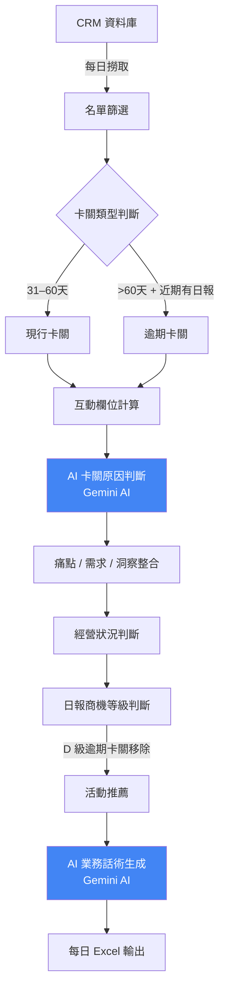
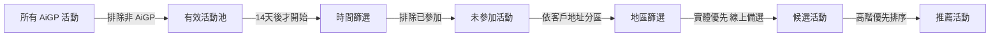
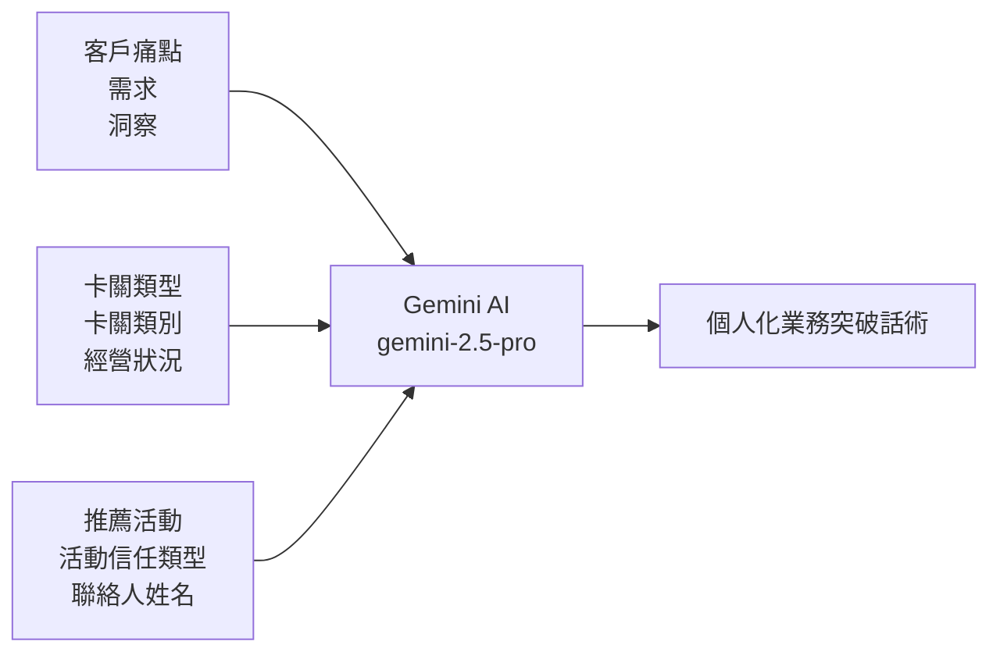

# AiGP 卡關商機分析系統

> 自動從 CRM 撈取卡關商機 → AI 分析卡關原因 → 生成個人化業務話術 → 推薦最適合的活動邀約

---

## 系統效益

| 指標 | 數字 |
|------|------|
| 每日自動分析筆數 | ~220 筆商機 |
| 需要邀約活動比例 | 97%（213/219） |
| AI 分析執行時間 | 5–8 分鐘 |
| 快取命中後執行時間 | < 1 分鐘 |

---

## 流程總覽



---

## 卡關分析邏輯

### 兩種卡關類型

| 類型 | 條件 |
|------|------|
| **現行卡關** | 商機建立距今 31–60 天（含 AiGP、老客、尚未升等） |
| **逾期卡關** | 商機建立距今 > 60 天 + 近 90 天有業務日報 + 日報等級非 D 級 |

### 四種卡關類別（可多選）

```
沒談到高階 ── 近期無高階主管或核決者接觸記錄
信任不足   ── 客戶需求、洞察、解決方案記錄不完整
沒參加活動 ── 近期無 AiGP 活動參與記錄
場景模糊   ── 痛點、需求、洞察資料缺乏
```

### 經營狀況判斷

| 最後日報距今 | 狀況 |
|-------------|------|
| ≤ 7 天 | 🟢 高度活躍 |
| 8–30 天 | 🟡 中度活躍 |
| 31–90 天 | 🟠 低度經營 |
| > 90 天 | 🔴 已停止經營 |

---

## 活動推薦邏輯



**推薦欄位說明**

| 欄位 | 說明 |
|------|------|
| 推薦活動 | 活動名稱 |
| 推薦活動時間 | 客戶所在地區的最近場次日期 |
| 推薦活動地區 | 客戶所在分區（台北/桃園/新竹/台中/台南/高雄） |
| 推薦活動信任類型 | 知道（認識） / 認同（接受） / 相信（深度認可） |

---

## 業務話術生成



- **模型**：Google Gemini 2.5 Pro（Vertex AI）
- **方式**：Prompt Engineering（無 RAG、無 Fine-tuning）
- **平行度**：15 個執行緒同時生成，5–8 分鐘完成 ~220 筆
- **快取**：相同商機資料不重複呼叫 API，節省時間與費用

---

## 輸出欄位（主要）

| 類別 | 欄位 |
|------|------|
| 基礎資訊 | 卡關類型、商機建立天數、客戶地區 |
| AI 分析 | 卡關類別（多選）、AI判斷卡關原因 |
| 經營狀況 | 高度活躍 / 中度活躍 / 低度經營 / 已停止經營 |
| 等級評估 | 日報商機等級（B / C1 / D） |
| 話術 | 業務突破話術（個人化） |
| 活動 | 推薦活動、時間、地區、信任類型 |

---

## 技術架構

```
程式語言：Python 3.x
AI 模型  ：Google Gemini 2.5 Pro（Vertex AI）
資料庫   ：Microsoft SQL Server（ODBC）
快取機制 ：JSON 檔案（卡關判斷快取 + 話術快取）
輸出格式 ：Excel（openpyxl）
執行方式 ：每日手動或排程執行
```

---

## 執行結果範例（2026-06-11）

```
現行卡關：127 筆
逾期卡關：135 筆（移除 D 級 43 筆後剩 92 筆）
分析總筆數：219 筆
需要邀約活動：213 筆（97%）
```

**卡關類別分布**

| 類別 | 比例 |
|------|------|
| 沒談到高階 | 81.7% |
| 信任不足 | 81.7% |
| 沒參加活動 | 63.0% |
| 場景模糊 | 38.9% |

---

*最後更新：2026-06-11*
